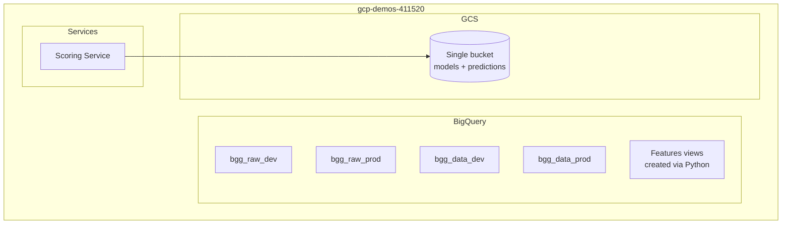
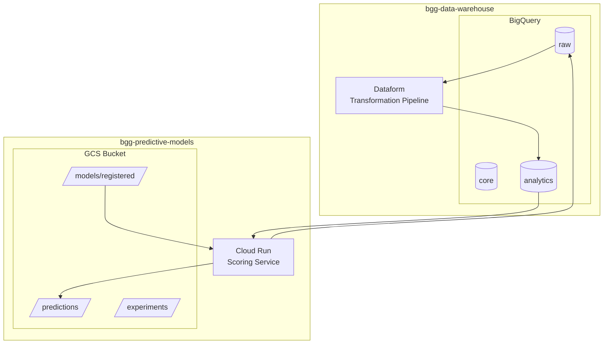
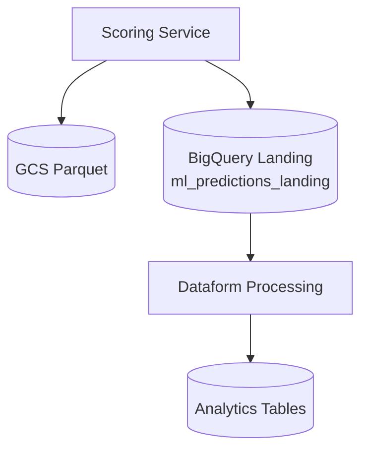

# Changelog

All notable changes to this project are documented in this file.

## [Unreleased]

### Added

- **Artifact Registry Cleanup Policy**: Terraform-managed cleanup policies to reduce storage costs
  - Keeps 5 most recent images per package
  - Deletes untagged images after 7 days
  - Deletes old tagged images after 14 days
  - Repository: `us-central1-docker.pkg.dev/bgg-predictive-models/bgg-predictive-models`

### Changed

- **Scoring Service Model Version Detection**: Added model version checking to change detection logic
  - Games are now rescored when deployed model versions differ from the versions used for their last predictions
  - Applies to all 4 prediction models (hurdle, complexity, rating, users_rated)
  - Matches the existing behavior in the embeddings service
  - Combined with feature hash checking, ensures games are scored with latest models

- **Pipeline event flow redesign**: Fixed data dependency bug where embeddings used stale complexity predictions
  - Complexity scoring now sends `complexity_complete` event to trigger Dataform
  - Scoring service triggered by `dataform_complexity_ready` (after complexity materialized)
  - Text embeddings now runs before game embeddings (future-proofing for dependency)
  - Game embeddings sends `embeddings_complete` to trigger final Dataform run
  - Removed all cron schedules - pipeline is purely event-driven
  - See bgg-data-warehouse `docs/plans/2026-01-27-pipeline-event-flow-design.md` for full design

### Added

- **VAE Embedding Algorithm**: Added Variational Autoencoder as embedding algorithm option
- **Validation Loss Tracking**: Autoencoder and VAE now track validation loss during training
  - `fit()` accepts optional `X_val` parameter for validation data
  - Early stopping based on validation loss when validation data provided
  - Training loss plot shows both training and validation curves
- **Feature Transformer**: Added `include_count_features` parameter to `BaseBGGTransformer`
  - Controls whether `mechanics_count` and `categories_count` features are included
  - `EmbeddingTransformer` defaults to `False` (excludes count features from embeddings)
- **PCA Model Registration**: Registered embedding models now save and load PCA 2D projection models
  - Mirrors existing UMAP model support for coordinate generation
- Terraform infrastructure management (`terraform/` directory)
- GitHub Actions workflow for Terraform deployment (`.github/workflows/terraform.yml`)
- Collection loader system for user collection predictions (`src/collection/`)
- Experiment loader utility for cloud-based experiment tracking (`src/utils/experiment_loader.py`)
- Data warehouse prediction uploader with BigQuery landing table (`src/data/bigquery_uploader.py`)
- Dedicated evaluation script (`evaluate.py`) for time-based model evaluation

### Changed

- **Embedding Training Workflow**: Improved autoencoder/VAE training to follow proper ML workflow
  - First fit uses tune set as validation for early stopping
  - Final fit on train+tune uses optimal epochs from tuning (no validation)
  - Tuning history preserved for loss plot visualization
- **Embedding Service Change Detection**: Now filters by `embedding_model` name
  - Promoting a new model triggers full regeneration of embeddings
  - Previously only checked if any embedding existed for a game
- **CLI Config Precedence**: Training CLI arguments now default to `None` so `config.yaml` values are used
  - Explicit CLI args still override config values
- **Embedding Family Patterns**: Removed `^Series:` from default family patterns
  - Series families are now excluded from embedding features by default
- **GCP Project Migration**: Migrated from `gcp-demos-411520` to dedicated two-project architecture
  - `bgg-data-warehouse`: Data storage, BigQuery tables, prediction landing
  - `bgg-predictive-models`: ML models, experiment tracking, scoring service
- **Dataset Naming**: Simplified from environment-suffixed names (`bgg_raw_dev`, `bgg_data_prod`) to clean names (`raw`, `core`, `analytics`)
- **Configuration**: Centralized config in `config.yaml` replacing multi-environment `bigquery.yaml` complexity
- **Docker Structure**: Moved Dockerfiles to `docker/` directory with clearer naming
- **Scoring Service**: Now uploads predictions to both GCS and BigQuery landing table
- **Streamlit Dashboard**: Reorganized pages, added BGG logo, improved experiment visualization

### Fixed

- **Logging Duplication**: Fixed duplicate log output in embedding training by checking for existing handlers

### Removed

- `src/data/create_view.py` - Materialized views now managed by Dataform
- `src/data/games_features_materialized_view.sql` - Moved to data warehouse project
- `Dockerfile.streamlit` - Replaced by `docker/streamlit.Dockerfile`
- Environment-based configuration complexity

---

## Architecture Changes: 0.1.0 → 0.2.0

### Previous Architecture (0.1.0)



**0.1.0 Configuration (`bigquery.yaml`):**
```yaml
environments:
  dev:
    project_id: gcp-demos-411520
    datasets:
      raw: bgg_raw_dev
      core: bgg_data_dev
  prod:
    project_id: gcp-demos-411520
    datasets:
      raw: bgg_raw_prod
      core: bgg_data_prod
```

**0.1.0 Prediction Flow:**


---

### Current Architecture (0.2.0)



**0.2.0 Configuration (`config.yaml`):**

```yaml
data_warehouse:
  project_id: bgg-data-warehouse
  datasets:
    raw: raw
    core: core
    analytics: analytics

ml_project:
  project_id: bgg-predictive-models
  bucket_name: bgg-predictive-models

predictions:
  project_id: bgg-data-warehouse
  dataset: raw
  table: ml_predictions_landing
```

**0.2.0 Prediction Flow:**



---

### Key Differences Summary

| Aspect | 0.1.0 | 0.2.0 |
|--------|-------|-------|
| **GCP Projects** | Single (`gcp-demos-411520`) | Two projects (data + ML) |
| **Dataset Names** | Environment-suffixed | Clean names (`raw`, `core`, `analytics`) |
| **Infrastructure** | Manual/ad-hoc | Terraform-managed |
| **Features View** | Python script (`create_view.py`) | Dataform in data warehouse |
| **Prediction Storage** | GCS only | GCS + BigQuery landing table |
| **Configuration** | Complex multi-env YAML | Simple centralized `config.yaml` |
| **Environment Handling** | Config-based switching | Path prefix in GCS (`dev/`, `prod/`) |

---

### Migration Reference

For detailed migration steps, see [docs/MIGRATION_GCP_PROJECT.md](docs/MIGRATION_GCP_PROJECT.md).

---

## Version History

### [0.2.2] - Current

Enhanced scoring service with ad-hoc predictions and automated complexity scoring.

#### Added

- **Ad-hoc Scoring**: Added `game_ids` parameter to all prediction endpoints
  - `/predict_games`, `/predict_complexity`, `/predict_hurdle`, `/predict_rating`, `/predict_users_rated`
  - When `game_ids` is provided, predictions are returned directly in the response
  - No persistence to BigQuery or GCS for ad-hoc requests
  - Enables quick testing and on-demand scoring of specific games
- **Individual Model Endpoints**: Dedicated endpoints for each model type
  - `/predict_complexity` - Scores complexity with change detection and BigQuery persistence
  - `/predict_hurdle` - Returns hurdle probabilities without persistence
  - `/predict_rating` - Returns rating predictions without persistence
  - `/predict_users_rated` - Returns users_rated predictions without persistence
- **Automated Complexity Scoring**: GitHub Actions workflow for daily complexity predictions
  - Runs daily at 6 AM UTC via cron schedule
  - Uses change detection via `game_features_hash` table (maintained in Dataform)
  - Scores only new games or games with changed features
  - Uploads predictions to `bgg-predictive-models.raw.complexity_predictions` table
  - Manual trigger option with model name override

#### Changed

- **Complexity Scoring**: Removed arbitrary `max_games` limit
  - Scores all games that need predictions based on change detection
  - No artificial cap on number of games per run
- **BigQuery Client**: Fixed to use `bgg-data-warehouse` project for game data queries
  - Ensures proper permissions for cross-project queries
  - Consistent with data warehouse architecture
- **Makefile**: Updated Docker configuration
  - Corrected Dockerfile paths to `docker/` directory
  - Changed scoring service port from 8080 to 8087 (local development)
  - Added `GCP_PROJECT_ID` to `.env` for authentication

#### Fixed

- **Response Models**: Made `table_id` optional in prediction response models
  - Allows endpoints to return `null` when not persisting to BigQuery
  - Fixes validation errors for ad-hoc scoring requests

### [0.2.1]

Bug fixes and BigQuery schema improvements.

#### Fixed

- **Scoring Service Docker**: Fixed sklearn version compatibility issue by using lock file (`uv.lock`) instead of resolving dependencies fresh
  - Ensures scoring service uses same sklearn version (1.7.0) as training environment
  - Prevents model loading failures due to pickle incompatibility between sklearn versions
- **Environment Configuration**: Improved environment variable handling in Cloud Run deployment

#### Changed

- **BigQuery Schema**: Restructured `ml_predictions_landing` table to use separate columns for model metadata instead of single JSON column
  - Added individual columns for each model: `{model}_model_name`, `{model}_model_version`, `{model}_experiment`
  - Improved queryability and compatibility with BigQuery's native types
  - Models tracked: hurdle, complexity, rating, users_rated, geek_rating
  - `geek_rating_model_name` defaults to "computed" (future-proofing for dedicated model)
- **Model Metadata**: Enhanced model version tracking to include experiment names alongside model names and versions

### [0.2.0]

Two-project GCP architecture with Terraform-managed infrastructure.

- Two-project GCP architecture (`bgg-data-warehouse` + `bgg-predictive-models`)
- Terraform infrastructure management
- BigQuery prediction landing table (`ml_predictions_landing`)
- Dataform integration for data transformations
- Simplified configuration (`config.yaml`)
- Clean dataset names (`raw`, `core`, `analytics`)

### [0.1.0] - Previous

Single GCP project architecture with environment-based configuration.

- Single GCP project (`gcp-demos-411520`)
- Environment-suffixed datasets (`bgg_raw_dev`, `bgg_data_prod`)
- Manual infrastructure management
- GCS-only prediction storage
- Multi-environment configuration (`bigquery.yaml`)
