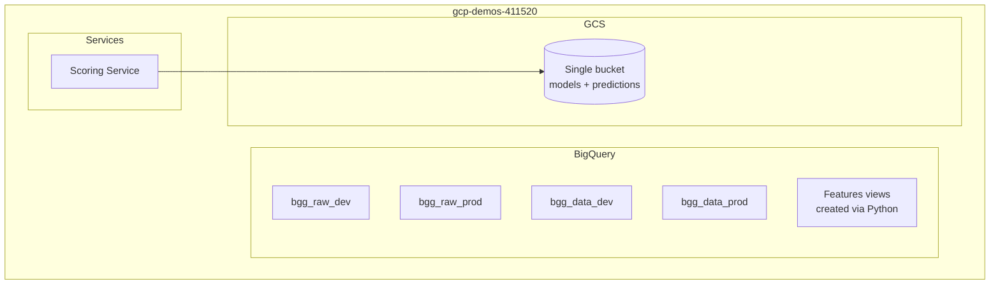
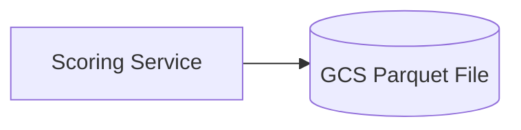
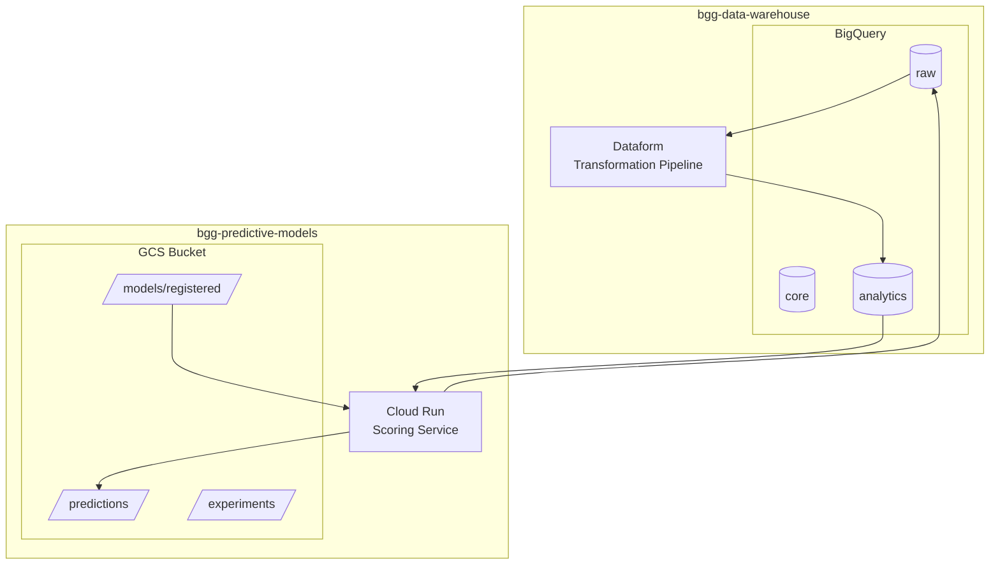
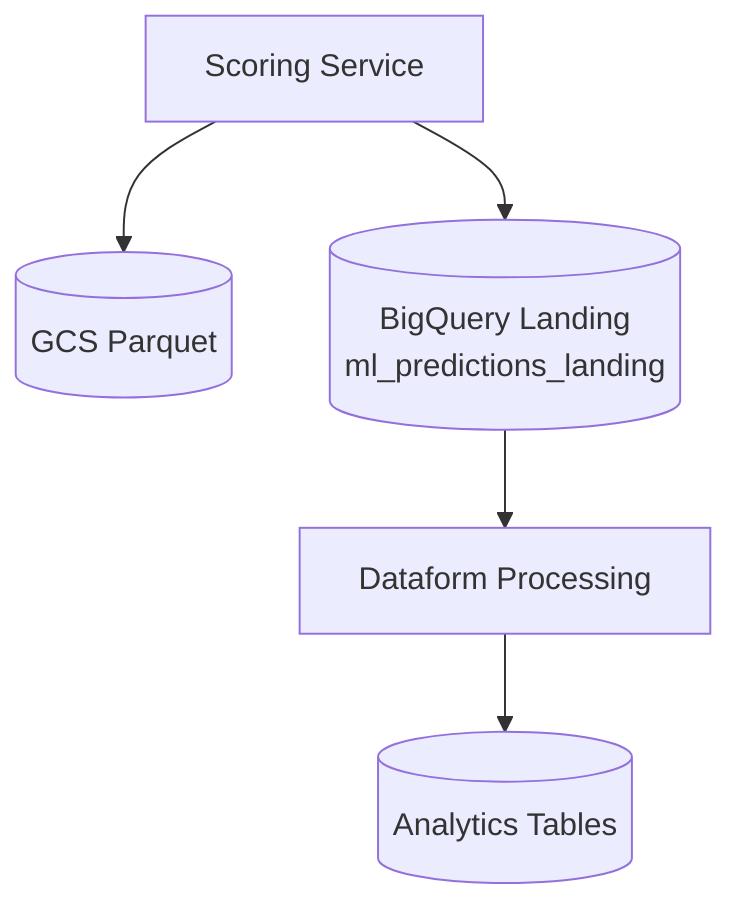

# Changelog

All notable changes to this project are documented in this file.

## [Unreleased]

### Added
- Terraform infrastructure management (`terraform/` directory)
- GitHub Actions workflow for Terraform deployment (`.github/workflows/terraform.yml`)
- Collection loader system for user collection predictions (`src/collection/`)
- Experiment loader utility for cloud-based experiment tracking (`src/utils/experiment_loader.py`)
- Data warehouse prediction uploader with BigQuery landing table (`src/data/bigquery_uploader.py`)
- Dedicated evaluation script (`evaluate.py`) for time-based model evaluation

### Changed
- **GCP Project Migration**: Migrated from `gcp-demos-411520` to dedicated two-project architecture
  - `bgg-data-warehouse`: Data storage, BigQuery tables, prediction landing
  - `bgg-predictive-models`: ML models, experiment tracking, scoring service
- **Dataset Naming**: Simplified from environment-suffixed names (`bgg_raw_dev`, `bgg_data_prod`) to clean names (`raw`, `core`, `analytics`)
- **Configuration**: Centralized config in `config.yaml` replacing multi-environment `bigquery.yaml` complexity
- **Docker Structure**: Moved Dockerfiles to `docker/` directory with clearer naming
- **Scoring Service**: Now uploads predictions to both GCS and BigQuery landing table
- **Streamlit Dashboard**: Reorganized pages, added BGG logo, improved experiment visualization

### Removed
- `src/data/create_view.py` - Materialized views now managed by Dataform
- `src/data/games_features_materialized_view.sql` - Moved to data warehouse project
- `Dockerfile.streamlit` - Replaced by `docker/streamlit.Dockerfile`
- Environment-based configuration complexity

---

## Architecture Changes: 0.1.0 → 0.2.0

### Previous Architecture (0.1.0)



**0.1.0 Configuration (`bigquery.yaml`):**
```yaml
environments:
  dev:
    project_id: gcp-demos-411520
    datasets:
      raw: bgg_raw_dev
      core: bgg_data_dev
  prod:
    project_id: gcp-demos-411520
    datasets:
      raw: bgg_raw_prod
      core: bgg_data_prod
```

**0.1.0 Prediction Flow:**



---

### Current Architecture (0.2.0)



**0.2.0 Configuration (`config.yaml`):**

```yaml
data_warehouse:
  project_id: bgg-data-warehouse
  datasets:
    raw: raw
    core: core
    analytics: analytics

ml_project:
  project_id: bgg-predictive-models
  bucket_name: bgg-predictive-models

predictions:
  project_id: bgg-data-warehouse
  dataset: raw
  table: ml_predictions_landing
```

**0.2.0 Prediction Flow:**



---

### Key Differences Summary

| Aspect | 0.1.0 | 0.2.0 |
|--------|-------|-------|
| **GCP Projects** | Single (`gcp-demos-411520`) | Two projects (data + ML) |
| **Dataset Names** | Environment-suffixed | Clean names (`raw`, `core`, `analytics`) |
| **Infrastructure** | Manual/ad-hoc | Terraform-managed |
| **Features View** | Python script (`create_view.py`) | Dataform in data warehouse |
| **Prediction Storage** | GCS only | GCS + BigQuery landing table |
| **Configuration** | Complex multi-env YAML | Simple centralized `config.yaml` |
| **Environment Handling** | Config-based switching | Path prefix in GCS (`dev/`, `prod/`) |

---

### Migration Reference

For detailed migration steps, see [docs/MIGRATION_GCP_PROJECT.md](docs/MIGRATION_GCP_PROJECT.md).

---

## Version History

### [0.2.0] - Current

Two-project GCP architecture with Terraform-managed infrastructure.

- Two-project GCP architecture (`bgg-data-warehouse` + `bgg-predictive-models`)
- Terraform infrastructure management
- BigQuery prediction landing table (`ml_predictions_landing`)
- Dataform integration for data transformations
- Simplified configuration (`config.yaml`)
- Clean dataset names (`raw`, `core`, `analytics`)

### [0.1.0] - Previous

Single GCP project architecture with environment-based configuration.

- Single GCP project (`gcp-demos-411520`)
- Environment-suffixed datasets (`bgg_raw_dev`, `bgg_data_prod`)
- Manual infrastructure management
- GCS-only prediction storage
- Multi-environment configuration (`bigquery.yaml`)
