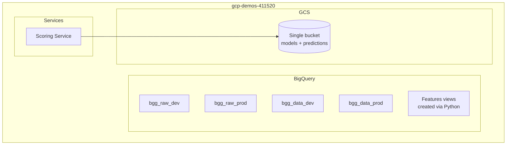
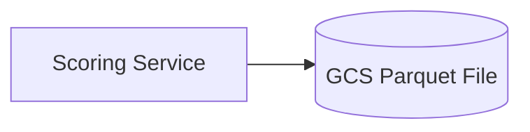
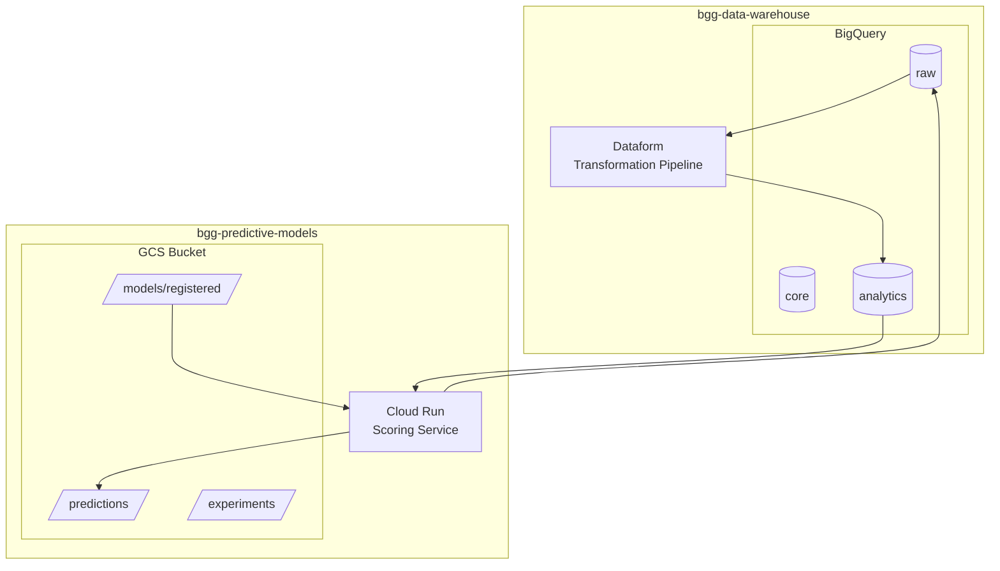
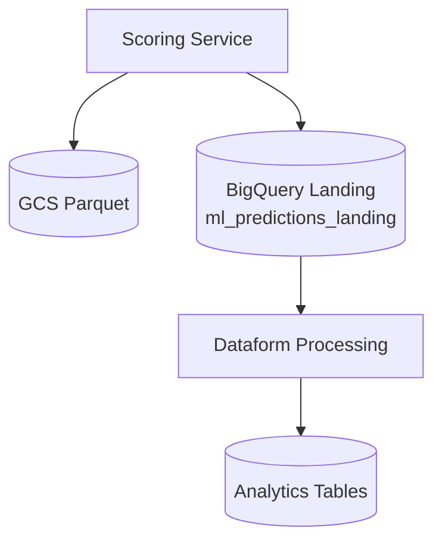

# Changelog

All notable changes to this project are documented in this file.

## [0.5.0] - 2026-04-29

### Added

- **Collection Modeling**: User-level prediction of game ownership and ratings (`src/collection/`)
  - New `src/collection/outcomes.py` defines outcomes declaratively in `config.yaml` under `collections.outcomes` (own, ever_owned, rated, rating, love)
  - `CollectionProcessor` is outcome-agnostic (canonicalize BGG column names + join with universe); labeling is applied downstream via `apply_outcome`
  - `CollectionSplitter` dispatches on `outcome.task` with two classification modes (`stratified_random`, `time_based` — the latter reuses `src.models.splitting.time_based_split`) and a regression path without negative sampling
  - `CollectionModel` dispatches on `outcome.task` with separate classification and regression training + evaluation paths
  - `CollectionArtifactStorage` paths include the outcome segment: `{username}/{outcome}/v{N}/` with per-outcome versioning
  - `CollectionPipeline.run_full_pipeline` loops over outcomes; `--outcome` CLI flag restricts training/refresh to a subset
  - New `Config.raw_config` field exposes the parsed YAML dict for sections that do not yet have typed dataclass representations
  - New Makefile targets: `train-collection`, `refresh-collection`, `collection-status` (all take `USERNAME=` and optional `OUTCOME=`)
  - New `justfile` recipes: `finalize-all` (runs finalize over every candidate in `config.collections.candidates`, continue-on-error) and `train-compare` (trains all candidates against an existing split for fast comparison iteration)
  - New Streamlit page (`7 Collections.py`) for exploring per-user collection predictions; per-chart subtitles show user · candidate · outcome
  - Feature importance plots in `src/collection/viz.py` promote `player_count_*` and `missingindicator_*` features into dedicated Players and Missingness groups (previously fell into Other)
  - Training side only; serving (`services/collections/`) is a follow-up
- **VAE Embedding Algorithm**: Added Variational Autoencoder as embedding algorithm option
- **Validation Loss Tracking**: Autoencoder and VAE now track validation loss during training
  - `fit()` accepts optional `X_val` parameter for validation data
  - Early stopping based on validation loss when validation data provided
  - Training loss plot shows both training and validation curves
- **PCA Model Registration**: Registered embedding models now save and load PCA 2D projection models
  - Mirrors existing UMAP model support for coordinate generation
- **Feature Transformer**: Added `include_count_features` parameter to `BaseBGGTransformer`
  - Controls whether `mechanics_count` and `categories_count` features are included
  - `EmbeddingTransformer` defaults to `False` (excludes count features from embeddings)
- **Terraform Infrastructure**: GCP resources managed as code (`terraform/` directory)
  - GitHub Actions workflow for Terraform deployment (`.github/workflows/terraform.yml`)
  - Artifact Registry cleanup policy: keeps 5 most recent images, deletes untagged after 7 days, deletes old tagged after 14 days
- **Experiment Loader**: Cloud-based experiment tracking utility (`src/utils/experiment_loader.py`)
- **BigQuery Prediction Uploader**: Data warehouse prediction uploader with BigQuery landing table (`src/data/bigquery_uploader.py`)
- **Evaluation Script**: Dedicated `evaluate.py` for time-based model evaluation

### Changed

- **Services Directory Consolidation**: Moved the three service directories under a unified `services/` directory
  - `scoring_service/` → `services/scoring/`
  - `embeddings_service/` → `services/game_embeddings/` (renamed)
  - `text_embeddings_service/` → `services/text_embeddings/`
  - Python imports updated from `scoring_service.*` / `embeddings_service.*` / `text_embeddings_service.*` to the new `services.*` paths
  - Dockerfiles, GitHub Actions path triggers, Makefile targets, and cloudbuild.yaml updated to match
  - No infrastructure changes: same Cloud Run service names, Artifact Registry repos, and image tags
- **Register Script Location**: Moved top-level `register.py` into `src/pipeline/register.py`
  - Sits alongside other pipeline orchestration modules (`train.py`, `evaluate.py`, `score.py`, `finalize.py`)
  - Now invoked via `uv run -m src.pipeline.register` (Makefile and training workflow updated)
- **Scoring Service Model Version Detection**: Added model version checking to change detection logic
  - Games are rescored when deployed model versions differ from the versions used for their last predictions
  - Applies to all 4 prediction models (hurdle, complexity, rating, users_rated)
  - Matches the existing behavior in the embeddings service
  - Combined with feature hash checking, ensures games are scored with latest models
- **Pipeline Event Flow Redesign**: Fixed data dependency bug where embeddings used stale complexity predictions
  - Complexity scoring now sends `complexity_complete` event to trigger Dataform
  - Scoring service triggered by `dataform_complexity_ready` (after complexity materialized)
  - Text embeddings now runs before game embeddings (future-proofing for dependency)
  - Game embeddings sends `embeddings_complete` to trigger final Dataform run
  - Removed all cron schedules — pipeline is purely event-driven
  - See bgg-data-warehouse `docs/plans/2026-01-27-pipeline-event-flow-design.md` for full design
- **Embedding Training Workflow**: Improved autoencoder/VAE training to follow proper ML workflow
  - First fit uses tune set as validation for early stopping
  - Final fit on train+tune uses optimal epochs from tuning (no validation)
  - Tuning history preserved for loss plot visualization
- **Embedding Service Change Detection**: Now filters by `embedding_model` name
  - Promoting a new model triggers full regeneration of embeddings
  - Previously only checked if any embedding existed for a game
- **CLI Config Precedence**: Training CLI arguments now default to `None` so `config.yaml` values are used
  - Explicit CLI args still override config values
- **Embedding Family Patterns**: Removed `^Series:` from default family patterns
  - Series families are now excluded from embedding features by default
- **GCP Project Migration**: Migrated from `gcp-demos-411520` to dedicated two-project architecture
  - `bgg-data-warehouse`: Data storage, BigQuery tables, prediction landing
  - `bgg-predictive-models`: ML models, experiment tracking, scoring service
- **Dataset Naming**: Simplified from environment-suffixed names (`bgg_raw_dev`, `bgg_data_prod`) to clean names (`raw`, `core`, `analytics`)
- **Configuration**: Centralized config in `config.yaml` replacing multi-environment `bigquery.yaml` complexity
- **Docker Structure**: Moved Dockerfiles to `docker/` directory with clearer naming
- **Scoring Service**: Now uploads predictions to both GCS and BigQuery landing table
- **Streamlit Dashboard**: Reorganized pages, added BGG logo, improved experiment visualization

### Fixed

- **Logging Duplication**: Fixed duplicate log output in embedding training by checking for existing handlers

### Removed

- `src/data/create_view.py` — Materialized views now managed by Dataform
- `src/data/games_features_materialized_view.sql` — Moved to data warehouse project
- `Dockerfile.streamlit` — Replaced by `docker/streamlit.Dockerfile`
- `collection_integration.py` and `tests/test_collection_integration.py` (logic merged into `collection_processor.py`)
- Environment-based configuration complexity

## [0.4.1] - 2026-03-06

### Fixed

- **Complexity Scoring Endpoint**: Fixed `predict_complexity` to load embeddings data
  - `load_games_for_complexity_scoring` was using `loader.load_data()` (no embeddings) instead of `loader.load_data_with_embeddings()`
  - Model pipelines expect `emb_0..emb_N` embedding features from training; missing embeddings caused HTTP 500 errors
  - Also fixed table alias in WHERE clause (`game_id` → `f.game_id`) for the embeddings join query

## [0.4.0] - 2026-03-04

### Added

- **Prediction Explainability Endpoint**: `/explain_game` endpoint on the scoring service
  - Returns per-feature contribution breakdowns for all outcomes (complexity, rating, users_rated, geek_rating)
  - Handles model dependency chain internally (complexity → rating/users_rated → geek_rating)
  - Uses `LinearExplainer` to decompose linear model predictions into feature contributions
  - Returns feature names, raw values, coefficients, and contribution magnitudes
- **Bayesian Simulation Endpoint**: `/simulate_games` endpoint with posterior sampling
  - Generates credible intervals (90% and 50%) for all predictions
  - Supports configurable number of posterior samples
- **Geek Rating Direct Model**: Dedicated trained model for geek_rating prediction
  - Replaces computed Bayesian average with a direct regression model
  - Uses predicted complexity, rating, and users_rated as features

### Changed

- **Model Registration**: `load_pipeline()` now prefers finalized model when available
  - Finalized models are trained on all data (train + tune + test)
  - Registration now correctly uploads the finalized pipeline to GCS
  - Fixes bug where train-split-only models were being registered
- **Makefile Improvements**:
  - `start-scoring` now builds the Docker image automatically (depends on `docker-scoring`)
  - Named container (`bgg-scoring`) for reliable `stop-scoring`
  - Fixed port mismatch: scoring service targets now use port 8087 consistently
- **LinearExplainer**: Extracts feature names from preprocessor output when `experiment_dir` is not available
  - Enables meaningful feature names in the scoring service context

### Fixed

- **finalize.py**: Fixed geek_rating CLI args to route through `src.pipeline.train` with correct argument names
- **Scoring service port**: `scoring-service` and `scoring-service-upload` targets now use port 8087 to match Docker mapping

---

## Architecture Changes: 0.1.0 → 0.2.0

### Previous Architecture (0.1.0)


```mermaid
flowchart TD
    subgraph gcp-demos-411520
        subgraph BigQuery
            raw_dev[bgg_raw_dev]
            raw_prod[bgg_raw_prod]
            data_dev[bgg_data_dev]
            data_prod[bgg_data_prod]
            views[Features views<br/>created via Python]
        end

        subgraph GCS
            bucket[(Single bucket<br/>models + predictions)]
        end

        subgraph Services
            scoring[Scoring Service]
        end
    end

    scoring --> bucket
```

**0.1.0 Configuration (`bigquery.yaml`):**
```yaml
environments:
  dev:
    project_id: gcp-demos-411520
    datasets:
      raw: bgg_raw_dev
      core: bgg_data_dev
  prod:
    project_id: gcp-demos-411520
    datasets:
      raw: bgg_raw_prod
      core: bgg_data_prod
```

**0.1.0 Prediction Flow:**


```mermaid
flowchart LR
    A[Scoring Service] --> B[(GCS Parquet File)]
```

---

### Current Architecture (0.2.0)


```mermaid
flowchart TD
    subgraph bgg-data-warehouse [bgg-data-warehouse]
        subgraph BigQuery
            raw[(raw)]
            core[(core)]
            analytics[(analytics)]
        end
        dataform[Dataform<br/>Transformation Pipeline]
    end

    subgraph bgg-predictive-models [bgg-predictive-models]
        subgraph GCS Bucket
            models[/models/registered/]
            predictions[/predictions/]
            experiments[/experiments/]
        end
        cloudrun[Cloud Run<br/>Scoring Service]
    end

    cloudrun --> predictions
    cloudrun --> raw
    raw --> dataform
    dataform --> analytics
    analytics --> cloudrun
    models --> cloudrun
```

**0.2.0 Configuration (`config.yaml`):**

```yaml
data_warehouse:
  project_id: bgg-data-warehouse
  datasets:
    raw: raw
    core: core
    analytics: analytics

ml_project:
  project_id: bgg-predictive-models
  bucket_name: bgg-predictive-models

predictions:
  project_id: bgg-data-warehouse
  dataset: raw
  table: ml_predictions_landing
```

**0.2.0 Prediction Flow:**


```mermaid
flowchart TD
    A[Scoring Service] --> B[(GCS Parquet)]
    A --> C[(BigQuery Landing<br/>ml_predictions_landing)]
    C --> D[Dataform Processing]
    D --> E[(Analytics Tables)]
```

---

### Key Differences Summary

| Aspect | 0.1.0 | 0.2.0 |
|--------|-------|-------|
| **GCP Projects** | Single (`gcp-demos-411520`) | Two projects (data + ML) |
| **Dataset Names** | Environment-suffixed | Clean names (`raw`, `core`, `analytics`) |
| **Infrastructure** | Manual/ad-hoc | Terraform-managed |
| **Features View** | Python script (`create_view.py`) | Dataform in data warehouse |
| **Prediction Storage** | GCS only | GCS + BigQuery landing table |
| **Configuration** | Complex multi-env YAML | Simple centralized `config.yaml` |
| **Environment Handling** | Config-based switching | Path prefix in GCS (`dev/`, `prod/`) |

---

### Migration Reference

For detailed migration steps, see [docs/MIGRATION_GCP_PROJECT.md](docs/MIGRATION_GCP_PROJECT.md).

---

## Version History

### [0.4.1] - Current

Bugfix for complexity scoring endpoint missing embeddings data.

### [0.4.0]

Prediction explainability, Bayesian simulation, and finalized model registration.

### [0.2.2]

Enhanced scoring service with ad-hoc predictions and automated complexity scoring.

#### Added

- **Ad-hoc Scoring**: Added `game_ids` parameter to all prediction endpoints
  - `/predict_games`, `/predict_complexity`, `/predict_hurdle`, `/predict_rating`, `/predict_users_rated`
  - When `game_ids` is provided, predictions are returned directly in the response
  - No persistence to BigQuery or GCS for ad-hoc requests
  - Enables quick testing and on-demand scoring of specific games
- **Individual Model Endpoints**: Dedicated endpoints for each model type
  - `/predict_complexity` - Scores complexity with change detection and BigQuery persistence
  - `/predict_hurdle` - Returns hurdle probabilities without persistence
  - `/predict_rating` - Returns rating predictions without persistence
  - `/predict_users_rated` - Returns users_rated predictions without persistence
- **Automated Complexity Scoring**: GitHub Actions workflow for daily complexity predictions
  - Runs daily at 6 AM UTC via cron schedule
  - Uses change detection via `game_features_hash` table (maintained in Dataform)
  - Scores only new games or games with changed features
  - Uploads predictions to `bgg-predictive-models.raw.complexity_predictions` table
  - Manual trigger option with model name override

#### Changed

- **Complexity Scoring**: Removed arbitrary `max_games` limit
  - Scores all games that need predictions based on change detection
  - No artificial cap on number of games per run
- **BigQuery Client**: Fixed to use `bgg-data-warehouse` project for game data queries
  - Ensures proper permissions for cross-project queries
  - Consistent with data warehouse architecture
- **Makefile**: Updated Docker configuration
  - Corrected Dockerfile paths to `docker/` directory
  - Changed scoring service port from 8080 to 8087 (local development)
  - Added `GCP_PROJECT_ID` to `.env` for authentication

#### Fixed

- **Response Models**: Made `table_id` optional in prediction response models
  - Allows endpoints to return `null` when not persisting to BigQuery
  - Fixes validation errors for ad-hoc scoring requests

### [0.2.1]

Bug fixes and BigQuery schema improvements.

#### Fixed

- **Scoring Service Docker**: Fixed sklearn version compatibility issue by using lock file (`uv.lock`) instead of resolving dependencies fresh
  - Ensures scoring service uses same sklearn version (1.7.0) as training environment
  - Prevents model loading failures due to pickle incompatibility between sklearn versions
- **Environment Configuration**: Improved environment variable handling in Cloud Run deployment

#### Changed

- **BigQuery Schema**: Restructured `ml_predictions_landing` table to use separate columns for model metadata instead of single JSON column
  - Added individual columns for each model: `{model}_model_name`, `{model}_model_version`, `{model}_experiment`
  - Improved queryability and compatibility with BigQuery's native types
  - Models tracked: hurdle, complexity, rating, users_rated, geek_rating
  - `geek_rating_model_name` defaults to "computed" (future-proofing for dedicated model)
- **Model Metadata**: Enhanced model version tracking to include experiment names alongside model names and versions

### [0.2.0]

Two-project GCP architecture with Terraform-managed infrastructure.

- Two-project GCP architecture (`bgg-data-warehouse` + `bgg-predictive-models`)
- Terraform infrastructure management
- BigQuery prediction landing table (`ml_predictions_landing`)
- Dataform integration for data transformations
- Simplified configuration (`config.yaml`)
- Clean dataset names (`raw`, `core`, `analytics`)

### [0.1.0] - Previous

Single GCP project architecture with environment-based configuration.

- Single GCP project (`gcp-demos-411520`)
- Environment-suffixed datasets (`bgg_raw_dev`, `bgg_data_prod`)
- Manual infrastructure management
- GCS-only prediction storage
- Multi-environment configuration (`bigquery.yaml`)
