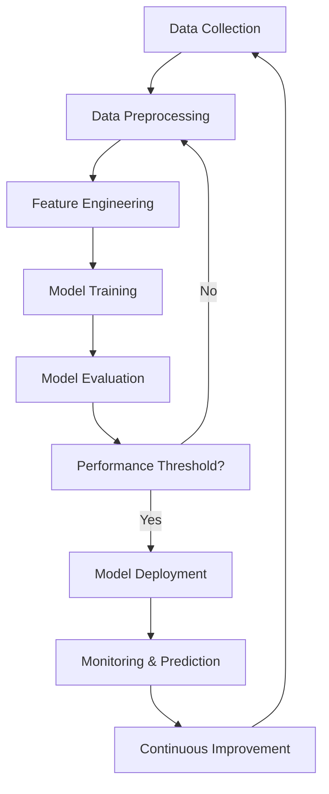

# BGG Predictive Models

## Project Overview

This project develops predictive models for board game characteristics using BoardGameGeek (BGG) data, focusing on complexity estimation, rating prediction, and game feature analysis.

## Project Structure

```
bgg-predictive-models/
├── config/           # Configuration files
├── credentials/      # Credential management
├── data/             # Data storage
├── figures/          # Visualization outputs
├── scoring_service/  # Cloud deployment service
├── src/              # Primary source code
│   ├── augment/      # Data augmentation
│   ├── data/         # Data loading and preparation
│   ├── features/     # Feature engineering
│   ├── models/       # Machine learning models
│   ├── monitor/      # Experiment and prediction monitoring
│   ├── scripts/      # Utility scripts
│   ├── utils/        # Utility functions
│   └── visualizations/ # Data visualization scripts
└── tests/            # Unit and integration tests
```

## Project Workflow



## Current State vs Roadmap

### Current State
- [x] BGG ETL pipeline
- [x] Materialized `game_features` views in BigQuery
- [x] Experiment tracking and model versioning
- [x] Scikit-learn compatible BGG preprocessor
- [x] Hurdle classification model
- [x] Complexity estimation model
- [x] Basic monitoring dashboards

### Roadmap
- [ ] Cloud deployment service
- [ ] Average rating model
- [ ] Users rated model
- [ ] Geek rating estimation
- [ ] Ensemble model development

## Key Components

### Data Preparation

- **Data Loading**: `src/data/get_raw_data.py`
- **Materialized Views**: `src/data/create_view.py`
- **Feature Preprocessing**: `src/features/preprocessor.py`

### Machine Learning Models
- **Hurdle Classificatione**: `src/models/hurdle.py`
- **Complexity Estimation**: `src/models/complexity.py`
- **Rating Prediction**: `src/models/rating.py`
- **Users Rated Prediction**: `src/models/users_rated.py`

### Monitoring and Visualization

- **Experiment Dashboard**: `src/monitor/experiment_dashboard.py`
- **Predictions Dashboard**: `src/monitor/predictions_dashboard.py`
- **Visualization Scripts**: `src/visualizations/`

## Creating Materialized Views

### Games Features Materialized View

To create the games features materialized view, use `uv run`:

```bash
# Ensure you have set the BGG_DATASET environment variable if not using the default
export BGG_DATASET=your_dataset_name

# Run the script using uv
uv run src/data/create_view.py
```

#### Environment Variables

- `BGG_DATASET`: The BigQuery dataset where the materialized view will be created
  - Default: `bgg_data_dev`
  - Set this to match your project's dataset configuration

#### Prerequisites

- Google Cloud credentials configured
- BigQuery access
- Python dependencies installed via `uv`

## Development Workflow

1. **Setup**: 
   ```bash
   # Install UV (if not already installed)
   curl -LsSf https://astral.sh/uv/install.sh | sh

   # Create virtual environment
   uv venv

   # Install dependencies
   uv sync
   ```

2. **Running Scripts**:
   ```bash
   # Train model experiment (hurdle: classification)
   uv run -m src.models.hurdle  --experiment my_experiment_name

   # Finalize model (hurdle)
   uv run -m src.models.finalize_model --model-type hurdle --experiment my_experiment_name

   # Score using the trained model
   uv run -m src.models.score --model-type complexity --experiment my_experiment_name
   ```

3. **Testing**:
   ```bash
   # Run tests
   uv run pytest
   ```

## Deployment

The project includes a scoring service for cloud deployment, configured with:
- `scoring_service/Dockerfile`
- `scoring_service/cloudbuild.yaml`
- `scoring_service/main.py`
