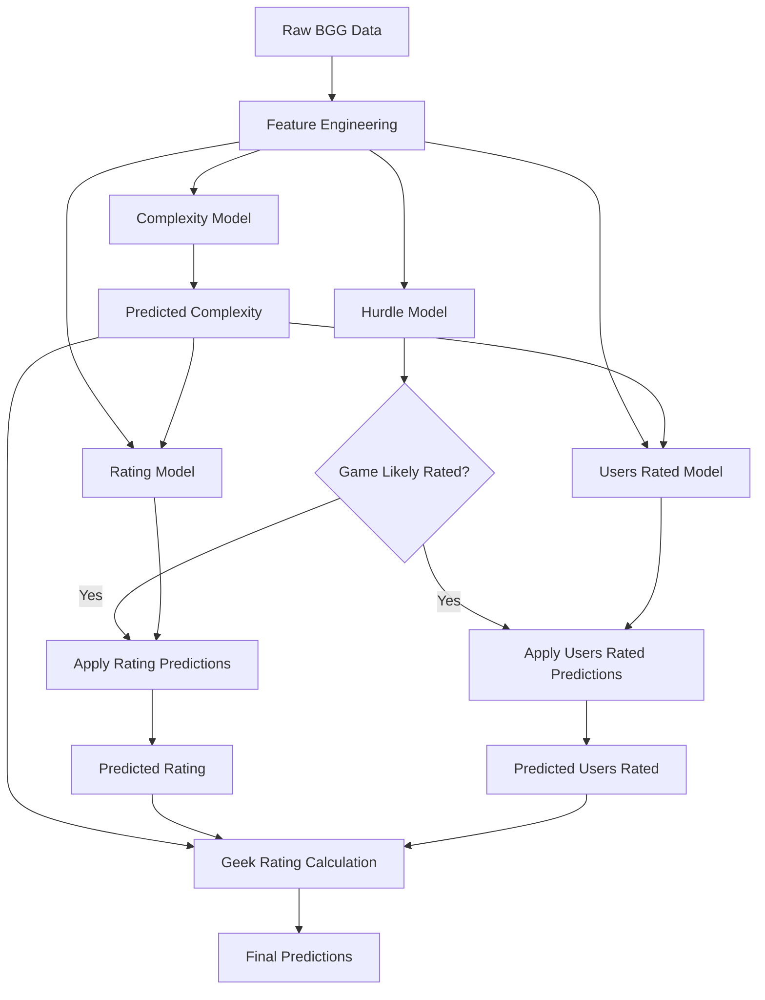
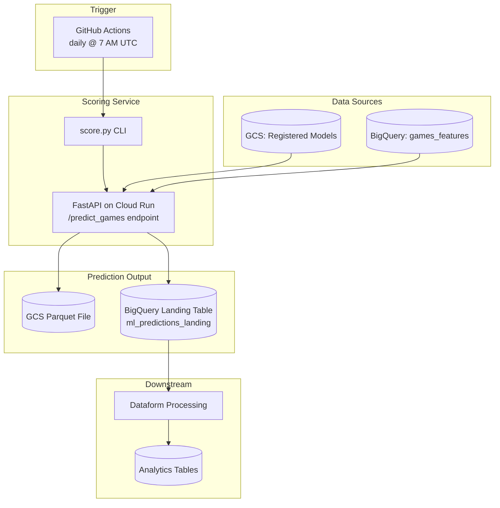

# BGG Predictive Models

## Project Overview

This project develops predictive models for board game characteristics using BoardGameGeek (BGG) data. The system predicts game complexity, average rating, number of users rated, and calculates estimated geek ratings using a comprehensive machine learning pipeline.

## Key Features

- **Complete ML Pipeline**: From data extraction to model deployment
- **Multiple Model Types**: Hurdle classification, complexity estimation, rating prediction, and user engagement modeling
- **Time-Based Evaluation**: Rolling window validation for temporal robustness
- **Production Deployment**: FastAPI scoring service with model registration and versioning
- **Interactive Dashboards**: Streamlit-based monitoring and visualization tools
- **Cloud Integration**: Google Cloud Platform integration for data storage and model deployment

## Project Structure

```
bgg-predictive-models/
├── config/              # Configuration files
├── credentials/         # Credential management
├── data/               # Data storage and predictions
├── figures/            # Visualization outputs
├── models/             # Trained models and experiments
├── scoring_service/    # Production deployment service
├── src/                # Primary source code
│   ├── data/           # Data loading and preparation
│   ├── features/       # Feature engineering and preprocessing
│   ├── models/         # Machine learning models
│   ├── monitor/        # Experiment and prediction monitoring
│   ├── scripts/        # Utility scripts
│   ├── utils/          # Utility functions
│   └── visualizations/ # Data visualization scripts
├── tests/              # Unit and integration tests
├── train.py            # Time-based model evaluation script
├── predict.py          # Prediction generation script
└── Makefile           # Automated workflow commands
```

## Current Capabilities

### ✅ Implemented Features

- **Data Pipeline**: Automated BGG data extraction and materialized views in BigQuery
- **Feature Engineering**: Comprehensive preprocessing pipeline with multiple transformer types
- **Model Training**: Four distinct model types with hyperparameter optimization
  - **Hurdle Model**: Predicts likelihood of games receiving ratings (logistic regression)
  - **Complexity Model**: Estimates game complexity (CatBoost/Ridge regression)
  - **Rating Model**: Predicts average game rating (CatBoost/Ridge regression)
  - **Users Rated Model**: Predicts number of users who will rate the game (LightGBM/Ridge regression)
- **Geek Rating Calculation**: Bayesian average calculation using predicted components
- **Time-Based Evaluation**: Rolling window validation across multiple years
- **Experiment Tracking**: Comprehensive experiment management and versioning
- **Model Registration**: Production model registration with validation and versioning
- **Scoring Service**: FastAPI-based REST API for model inference
- **Interactive Dashboards**: Real-time monitoring and visualization tools
- **Cloud Deployment**: Docker containers and Google Cloud Run deployment

### 🔄 Current Development Focus

- **Model Performance Optimization**: Continuous improvement of prediction accuracy
- **Feature Engineering**: Advanced feature transformations and selection
- **Ensemble Methods**: Combining multiple models for improved predictions
- **Real-time Monitoring**: Enhanced model performance tracking

## Quick Start

### Prerequisites

- Python 3.12+
- UV package manager
- Google Cloud credentials (for data access)
- Docker (for deployment)

### Installation

```bash
# Install UV (if not already installed)
curl -LsSf https://astral.sh/uv/install.sh | sh

# Clone repository
git clone https://github.com/phenrickson/bgg-predictive-models.git
cd bgg-predictive-models

# Install dependencies
uv sync

# Set up environment variables
cp .env.example .env
# Edit .env with your configuration
```

### Basic Usage

#### 1. Data Preparation
```bash
# Fetch raw data from BigQuery
make data

# Create materialized views
uv run src/data/create_view.py
```

#### 2. Model Training
```bash
# Train all models with default settings
make models

# Or train individual models
make hurdle      # Train hurdle classification model
make complexity  # Train complexity estimation model
make rating      # Train rating prediction model
make users_rated # Train users rated prediction model
```

#### 3. Generate Predictions
```bash
# Generate predictions for future games (2024-2029)
make predictions

# Or use the prediction script directly
uv run predict.py --start-year 2024 --end-year 2029
```

#### 4. Model Evaluation
```bash
# Run time-based evaluation across multiple years
make evaluate

# View current year configuration
make years
```

#### 5. Interactive Dashboards
```bash
# Launch experiment monitoring dashboard
make experiment_dashboard

# Launch geek rating analysis dashboard
make geek_rating_dashboard

# Launch unsupervised learning dashboard
make unsupervised_dashboard
```

## Model Architecture

### Prediction Pipeline



### Model Types and Algorithms

| Model Type | Purpose | Default Algorithm | Features |
|------------|---------|-------------------|----------|
| **Hurdle** | Classification of games likely to receive ratings | Logistic Regression | Linear preprocessor, probability output |
| **Complexity** | Game complexity estimation (1-5 scale) | CatBoost Regressor | Tree-based preprocessor, sample weights |
| **Rating** | Average rating prediction | CatBoost Regressor | Includes predicted complexity, sample weights |
| **Users Rated** | Number of users prediction | LightGBM Regressor | Log-transformed target, includes complexity |

### Feature Engineering

- **Categorical Encoding**: Target encoding for high-cardinality features
- **Numerical Transformations**: Log transforms, polynomial features, binning
- **Temporal Features**: Year-based transformations and era encoding
- **Text Processing**: Game description and mechanic embeddings
- **Sample Weighting**: Recency-based weighting for temporal relevance

## Production Deployment

### Architecture Overview

The system uses a two-project GCP architecture:

| Project | Purpose |
|---------|---------|
| `bgg-data-warehouse` | Data storage (BigQuery), feature tables, prediction landing |
| `bgg-predictive-models` | ML models (GCS), experiment tracking, scoring service |



### Prediction Output

The scoring service generates predictions with these columns:

| Column | Description |
|--------|-------------|
| `game_id` | BGG game identifier |
| `game_name` | Game name |
| `year_published` | Publication year |
| `predicted_hurdle_prob` | Probability game will receive ratings (0-1) |
| `predicted_complexity` | Predicted complexity/weight score |
| `predicted_rating` | Predicted average rating |
| `predicted_users_rated` | Predicted number of raters (min 25, rounded to 50) |
| `predicted_geek_rating` | Bayesian weighted rating (the "BGG Rank" score) |
| `model_versions` | JSON metadata with model names/versions |
| `score_ts` | Timestamp of prediction |

Predictions are stored in:
1. **GCS**: `gs://bgg-predictive-models/{env}/predictions/{job_id}_predictions.parquet`
2. **BigQuery**: `bgg-data-warehouse.raw.ml_predictions_landing` (partitioned by `score_ts`, clustered by `game_id`)

### Model Registration

```bash
# Register models for production use
make register

# Or register individual models
make register_complexity
make register_rating
make register_users_rated
make register_hurdle
```

### Scoring Service

```bash
# Run scoring service locally
make scoring-service

# Build and test Docker containers
make docker-scoring
make docker-training

# Deploy to Google Cloud Run
gcloud builds submit --config scoring_service/cloudbuild.yaml
```

### API Endpoints

| Endpoint | Method | Description |
|----------|--------|-------------|
| `/health` | GET | Health check with auth status |
| `/auth/status` | GET | Detailed authentication info |
| `/predict_games` | POST | Generate predictions |
| `/models` | GET | List registered models |
| `/model/{type}/{name}/info` | GET | Model details |

### API Usage

```python
import requests

# Score new games
response = requests.post(
    "http://localhost:8080/predict_games",
    json={
        "hurdle_model_name": "hurdle-v2026",
        "complexity_model_name": "complexity-v2026",
        "rating_model_name": "rating-v2026",
        "users_rated_model_name": "users_rated-v2026",
        "start_year": 2025,
        "end_year": 2030,
        "prior_rating": 5.5,
        "prior_weight": 2000,
        "upload_to_data_warehouse": True
    }
)

result = response.json()
# Returns: job_id, model_details, output_location, data_warehouse_job_id
```

## Configuration

### Environment Variables

Key environment variables (see `.env.example`):

```bash
# Google Cloud Configuration
GCP_PROJECT_ID=your-project-id
BGG_DATASET=bgg_data_dev
GCS_BUCKET_NAME=your-bucket-name

# Model Configuration
CURRENT_YEAR=2025
```

### Model Parameters

Default model configurations can be customized via command line arguments or the Makefile:

```bash
# Example: Use different algorithms
make complexity COMPLEXITY_MODEL=lightgbm
make rating RATING_MODEL=catboost
make users_rated USERS_RATED_MODEL=ridge
```

## Development Workflow

### Code Quality

```bash
# Format code
make format

# Lint code
make lint

# Run tests
uv run pytest
```

### Experiment Management

```bash
# Upload experiments to cloud storage
make upload_experiments

# Download experiments from cloud storage
make download_experiments

# Clean local experiments
make clean_experiments
```

### Time-Based Evaluation

The project uses a sophisticated time-based evaluation system:

- **Training Data**: All games published before 2021
- **Tuning Data**: Games published in 2021
- **Testing Data**: Games published in 2022
- **Prediction Target**: Games published 2024-2029

## Monitoring and Visualization

### Available Dashboards

1. **Experiment Dashboard**: Compare model performance across experiments
2. **Geek Rating Dashboard**: Analyze predicted vs actual geek ratings
3. **Unsupervised Dashboard**: Explore clustering and dimensionality reduction
4. **Predictions Dashboard**: Monitor prediction quality and distributions

### Key Metrics

- **Classification**: Precision, Recall, F1-score, AUC-ROC
- **Regression**: RMSE, MAE, R², Mean Absolute Percentage Error
- **Temporal Stability**: Performance consistency across time periods
- **Feature Importance**: Model interpretability metrics

## Advanced Features

### Time-Based Evaluation

```bash
# Evaluate models across multiple years with custom parameters
uv run train.py \
    --start-year 2016 \
    --end-year 2022 \
    --model-args \
        complexity.model=catboost \
        complexity.use-sample-weights=true \
        rating.model=ridge \
        rating.min-ratings=5
```

### Custom Predictions

```bash
# Generate predictions with custom parameters
uv run predict.py \
    --hurdle linear-hurdle \
    --complexity catboost-complexity \
    --rating ridge-rating \
    --users-rated lightgbm-users_rated \
    --start-year 2020 \
    --end-year 2030 \
    --threshold 0.6 \
    --prior-rating 5.5 \
    --prior-weight 2000
```

## Contributing

1. Fork the repository
2. Create a feature branch
3. Make changes with appropriate tests
4. Run code quality checks: `make format lint`
5. Submit a pull request

## License

This project is licensed under the MIT License - see the LICENSE file for details.

## Acknowledgments

- BoardGameGeek for providing comprehensive board game data
- The open-source machine learning community for excellent tools and libraries
