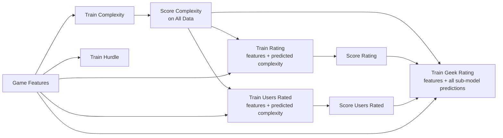
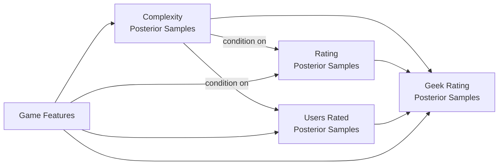
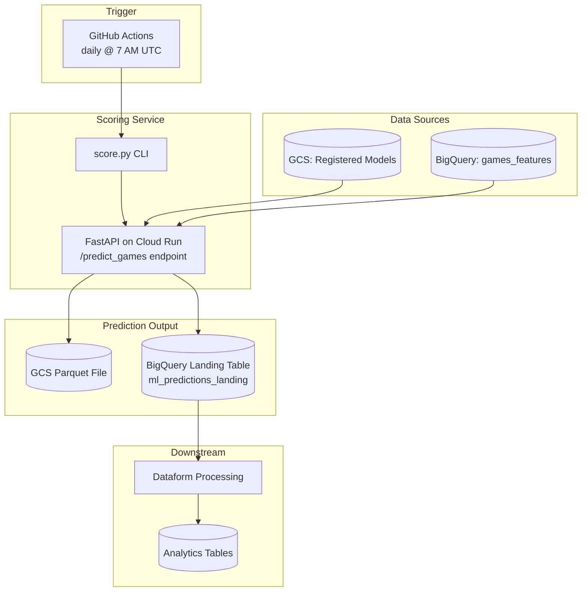

# BGG Predictive Models

## Project Overview

This project develops predictive models for board game characteristics using BoardGameGeek (BGG) data. The system predicts game complexity, average rating, number of users rated, and calculates estimated geek ratings using a comprehensive machine learning pipeline.

## Key Features

- **Complete ML Pipeline**: From data extraction to model deployment
- **Multiple Model Types**: Hurdle classification, complexity estimation, rating prediction, and user engagement modeling
- **Bayesian Uncertainty Estimation**: Posterior sampling with credible intervals via simulation
- **Model Explainability**: Per-feature contribution breakdowns for predictions
- **Time-Based Evaluation**: Rolling window validation (2018-2024) for temporal robustness
- **Game & Text Embeddings**: SVD, PCA, UMAP, and autoencoder embeddings for games; PMI word embeddings for descriptions
- **Production Deployment**: FastAPI scoring service with model registration and versioning
- **Interactive Dashboards**: Streamlit-based monitoring and visualization tools
- **Cloud Integration**: Google Cloud Platform integration for data storage, model deployment, and infrastructure (Terraform)

## Project Structure

```
bgg-predictive-models/
├── config/                    # Additional configuration files
├── config.yaml                # Central configuration for years, models, embeddings, scoring
├── credentials/               # Credential management
├── data/                      # Data storage and predictions
├── docker/                    # Dockerfiles (training, scoring, streamlit, embeddings)
├── docs/                      # Design documents and plans
├── figures/                   # Visualization outputs
├── models/                    # Trained models and experiments
├── references/                # Reference materials
├── scripts/                   # Utility scripts
├── services/                  # Production services (FastAPI)
│   ├── scoring/               # Scoring and prediction service
│   ├── game_embeddings/       # Game embedding inference service
│   └── text_embeddings/       # Text embedding inference service
├── src/                       # Primary source code
│   ├── collection/            # User collection modeling (outcomes, splitter, processor, pipeline)
│   ├── data/                  # Data loading and BigQuery integration
│   ├── debug/                 # Debugging utilities
│   ├── features/              # Feature engineering and preprocessing
│   ├── models/                # ML models (outcomes, embeddings, text embeddings)
│   ├── monitor/               # Experiment and prediction monitoring dashboards
│   ├── pipeline/              # Pipeline orchestration (train, evaluate, score, finalize, register)
│   ├── streamlit/             # Interactive Streamlit app with multiple pages
│   ├── utils/                 # Configuration, logging, experiment sync
│   └── visualizations/        # Data visualization scripts
├── terraform/                 # Infrastructure as Code (GCP resources)
├── tests/                     # Unit and integration tests
└── Makefile                   # Automated workflow commands
```

## Current Capabilities

### Implemented Features

- **Data Pipeline**: Automated BGG data extraction and materialized views in BigQuery
- **Feature Engineering**: Comprehensive preprocessing pipeline with multiple transformer types
- **Model Training**: Five distinct model types with hyperparameter optimization
  - **Hurdle Model**: Predicts likelihood of games receiving ratings (logistic regression)
  - **Complexity Model**: Estimates game complexity (ARD/CatBoost/Ridge regression)
  - **Rating Model**: Predicts average game rating (ARD/CatBoost/Ridge regression)
  - **Users Rated Model**: Predicts number of users who will rate the game (ARD/LightGBM/Ridge regression)
  - **Geek Rating Model**: Direct regression using predicted components and game features (ARD)
- **Bayesian Simulation**: Posterior sampling with credible intervals for uncertainty estimation
- **Model Explainability**: Per-feature SHAP-style contribution breakdowns
- **Time-Based Evaluation**: Rolling window validation across years 2018-2024
- **Game Embeddings**: PCA, SVD, UMAP, Autoencoder, and VAE for game similarity
- **Text Embeddings**: PMI-based word embeddings with SIF document aggregation from game descriptions
- **Experiment Tracking**: Comprehensive experiment management with cloud sync
- **Model Registration**: Production model registration with validation and versioning
- **Scoring Service**: FastAPI-based REST API for model inference
- **Interactive Dashboards**: Multi-page Streamlit app for exploration and monitoring
- **Cloud Deployment**: Docker containers, Google Cloud Run, Terraform-managed infrastructure

## Quick Start

### Prerequisites

- Python 3.12+
- UV package manager
- Google Cloud credentials (for data access)
- Docker (for deployment)

### Installation

```bash
# Install UV (if not already installed)
curl -LsSf https://astral.sh/uv/install.sh | sh

# Clone repository
git clone https://github.com/phenrickson/bgg-predictive-models.git
cd bgg-predictive-models

# Install dependencies
uv sync

# Set up environment variables
cp .env.example .env
# Edit .env with your configuration
```

### Basic Usage

#### 1. Data Preparation
```bash
# Fetch raw data from BigQuery
make data
```

#### 2. Model Training
```bash
# Train all models with default settings
make models

# Or train individual models
make hurdle      # Train hurdle classification model
make complexity  # Train complexity estimation model
make rating      # Train rating prediction model
make users_rated # Train users rated prediction model
make geek_rating # Train geek rating model
```

#### 3. Model Evaluation
```bash
# Run time-based evaluation across multiple years (2018-2024)
make evaluate

# Preview what evaluation would do
make evaluate-dry-run
```

#### 4. Finalize Models

```bash
# Finalize models on all data for production
make finalize
```

#### 5. Register Models

```bash
# Register models for production use (reads from config.yaml)
make register

# Preview registration
make register-dry-run
```

#### 6. Generate Predictions

```bash
# Score games using the scoring service
make start-scoring      # Start scoring service container
make scoring-service    # Run batch scoring
make stop-scoring       # Stop scoring service
```

#### 7. Train Embeddings

```bash
# Train game embeddings
make embeddings           # All algorithms (PCA, SVD, Autoencoder)
make embeddings_pca       # PCA only
make embeddings_svd       # SVD only
make embeddings_autoencoder  # Autoencoder only

# Train text embeddings from game descriptions
make text_embeddings
```

#### 8. Interactive Dashboards

```bash
# Launch the main Streamlit app
make streamlit

# Or launch individual monitoring dashboards
make experiments              # Experiment comparison dashboard
make predictions_dashboard    # Geek rating analysis dashboard
make unsupervised_dashboard   # Unsupervised learning dashboard
```

#### 9. User Collection Models

Predict which games a specific BGG user is likely to own, rate, or love.

```bash
# Train a collection model for a BGG user across all configured outcomes
make train-collection USERNAME=your_bgg_username

# Or restrict to a single outcome (own, ever_owned, rated, rating, love)
make train-collection USERNAME=your_bgg_username OUTCOME=own

# Refresh predictions for an existing collection model
make refresh-collection USERNAME=your_bgg_username

# Show stored collection artifacts and versions
make collection-status USERNAME=your_bgg_username
```

## Model Architecture

### Model Training

Each model is trained independently, but downstream models use upstream predictions as input features. Complexity is trained first, then scored on all data to produce predictions that become features for rating, users_rated, and geek_rating.


```mermaid
flowchart LR
    A[Game Features] --> B[Train Complexity]
    A --> H[Train Hurdle]
    B --> C[Score Complexity<br/>on All Data]
    C --> D[Train Rating<br/>features + predicted complexity]
    C --> E[Train Users Rated<br/>features + predicted complexity]
    A --> D
    A --> E
    D --> F[Score Rating]
    E --> G[Score Users Rated]
    C --> I[Train Geek Rating<br/>features + all sub-model predictions]
    F --> I
    G --> I
    A --> I
```

### Chained Simulation Pipeline

Predictions are generated via chained Bayesian posterior sampling. Each model draws `n_samples` from its posterior, and downstream models condition on those draws, propagating uncertainty through the full chain to produce geek rating simulations.


```mermaid
flowchart LR
    A[Game Features] --> B[Complexity<br/>Posterior Samples]
    B -->|condition on| C[Rating<br/>Posterior Samples]
    B -->|condition on| D[Users Rated<br/>Posterior Samples]
    B --> E[Geek Rating<br/>Posterior Samples]
    C --> E
    D --> E
    A --> C
    A --> D
    A --> E
```

1. **Complexity** — sample from posterior using game features
2. **Rating** — sample conditional on complexity draws + game features
3. **Users Rated** — sample conditional on complexity draws + game features
4. **Geek Rating** — sample conditional on all upstream draws + game features

Each game ends up with `n_samples` correlated draws across all outcomes, giving a full posterior distribution over geek rating that reflects uncertainty from every stage of the chain.

### Model Types and Algorithms

| Model Type | Purpose | Default Algorithm | Features |
|------------|---------|-------------------|----------|
| **Hurdle** | Classification of games likely to receive ratings | Logistic Regression | Embeddings, probability output |
| **Complexity** | Game complexity estimation (1-5 scale) | ARD Regression | Embeddings, optional sample weights |
| **Rating** | Average rating prediction | ARD Regression | Includes predicted complexity, embeddings, min 5 ratings |
| **Users Rated** | Number of users prediction | ARD Regression | Log-transformed target, embeddings |
| **Geek Rating** | BGG geek rating prediction | ARD Regression | Direct mode using game features + predicted components |

### Feature Engineering

- **Categorical Encoding**: Target encoding for high-cardinality features
- **Numerical Transformations**: Log transforms, polynomial features, binning
- **Temporal Features**: Year-based transformations and era encoding
- **Game Embeddings**: SVD/PCA/UMAP embeddings of game characteristics
- **Text Embeddings**: PMI word embeddings from game descriptions
- **Sample Weighting**: Optional recency-based weighting for temporal relevance

## Production Deployment

### Architecture Overview

The system uses a two-project GCP architecture:

| Project | Purpose |
|---------|---------|
| `bgg-data-warehouse` | Data storage (BigQuery), feature tables, analytics |
| `bgg-predictive-models` | ML models (GCS), experiment tracking, scoring service, predictions landing |


```mermaid
flowchart TD
    subgraph Trigger
        GHA[GitHub Actions<br/>daily @ 7 AM UTC]
    end

    subgraph Scoring Service
        CLI[score.py CLI]
        API[FastAPI on Cloud Run<br/>/predict_games endpoint]
        CLI --> API
    end

    subgraph Data Sources
        GCS_Models[(GCS: Registered Models)]
        BQ_Features[(BigQuery: games_features)]
    end

    subgraph Prediction Output
        GCS_Pred[(GCS Parquet File)]
        BQ_Landing[(BigQuery Landing Table<br/>ml_predictions_landing)]
    end

    subgraph Downstream
        Dataform[Dataform Processing]
        Analytics[(Analytics Tables)]
    end

    GHA --> CLI
    GCS_Models --> API
    BQ_Features --> API
    API --> GCS_Pred
    API --> BQ_Landing
    BQ_Landing --> Dataform
    Dataform --> Analytics
```

### Prediction Output

The scoring service generates predictions with these columns:

| Column | Description |
|--------|-------------|
| `game_id` | BGG game identifier |
| `game_name` | Game name |
| `year_published` | Publication year |
| `predicted_hurdle_prob` | Probability game will receive ratings (0-1) |
| `predicted_complexity` | Predicted complexity/weight score |
| `predicted_rating` | Predicted average rating |
| `predicted_users_rated` | Predicted number of raters (min 25, rounded to 50) |
| `predicted_geek_rating` | Predicted geek rating from direct regression model |
| `score_ts` | Timestamp of prediction |

Predictions are stored in:

1. **GCS**: `gs://bgg-predictive-models/{env}/predictions/{job_id}_predictions.parquet`
2. **BigQuery**: `bgg-predictive-models.raw.ml_predictions_landing` (partitioned by `score_ts`, clustered by `game_id`)

### Scoring Service

```bash
# Run scoring service locally via Docker
make start-scoring        # Build image and start container
make scoring-service      # Run batch scoring against local service
make scoring-service-upload  # Score and upload to BigQuery
make stop-scoring         # Stop container

# Deploy to Google Cloud Run
gcloud builds submit --config services/scoring/cloudbuild.yaml
```

### API Endpoints

| Endpoint | Method | Description |
|----------|--------|-------------|
| `/health` | GET | Health check with auth status |
| `/auth/status` | GET | Detailed authentication info |
| `/predict_games` | POST | Generate predictions |
| `/simulate_games` | POST | Predictions with Bayesian posterior sampling and credible intervals |
| `/predict_complexity` | POST | Complexity predictions with change detection |
| `/predict_hurdle` | POST | Hurdle probability predictions |
| `/predict_rating` | POST | Rating predictions |
| `/predict_users_rated` | POST | Users rated predictions |
| `/explain_game` | POST | Per-feature contribution breakdown for a game across all outcomes |
| `/models` | GET | List registered models |
| `/model/{type}/{name}/info` | GET | Model details |

### API Usage

```python
import requests

SERVICE_URL = "http://localhost:8087"

# Simulate games with Bayesian posterior sampling
response = requests.post(
    f"{SERVICE_URL}/simulate_games",
    json={
        "hurdle_model_name": "hurdle-v2026",
        "complexity_model_name": "complexity-v2026",
        "rating_model_name": "rating-v2026",
        "users_rated_model_name": "users_rated-v2026",
        "geek_rating_model_name": "geek_rating-v2026",
        "game_ids": [456459],
        "n_samples": 1000,
        "upload_to_data_warehouse": False
    }
)
# Returns: predictions with point estimates and 90%/50% credible intervals

# Explain a game's predictions (feature contributions)
response = requests.post(
    f"{SERVICE_URL}/explain_game",
    json={
        "game_id": 456459,
        "complexity_model_name": "complexity-v2026",
        "rating_model_name": "rating-v2026",
        "users_rated_model_name": "users_rated-v2026",
        "geek_rating_model_name": "geek_rating-v2026",
        "top_n": 15
    }
)
# Returns: per-feature contributions for complexity, rating, users_rated, geek_rating
```

## Configuration

All model, year, and pipeline settings are managed in `config.yaml`.

### Year Configuration

```yaml
years:
  current: 2026
  training:
    train_through: 2022  # Train on data through this year
    tune_start: 2023
    tune_through: 2023
    test_start: 2024
    test_through: 2024
  eval:
    start: 2018          # Rolling evaluation start
    end: 2024            # Rolling evaluation end
  score:
    start: 2025          # Prediction range start
    end: 2030            # Prediction range end
```

### Model Configuration

Default model types are configured in `config.yaml` under the `models` key. Override at the CLI level:

```bash
# Example: Use different algorithms via pipeline CLI
uv run -m src.pipeline.train --model complexity
uv run -m src.pipeline.train --model rating
```

### Environment Variables

Key environment variables (see `.env.example`):

```bash
# Google Cloud Configuration
GCP_PROJECT_ID=your-project-id
GCS_BUCKET_NAME=your-bucket-name
```

## Development Workflow

### Code Quality

```bash
# Format code
make format

# Lint code
make lint

# Fix linting issues
make fix

# Run tests
make test
```

### Experiment Management

```bash
# Upload experiments to Google Cloud Storage
make upload-experiments

# Download experiments from cloud storage
make download-experiments

# Clean local experiments
make clean-experiments
```

### Streamlit App

The Streamlit app (`src/streamlit/Home.py`) provides multiple pages:

1. **Predictions**: Explore prediction distributions by year
2. **Experiments**: Compare model performance across experiments
3. **Simulations**: Review Bayesian simulation results with credible intervals
4. **Game Embeddings**: Explore dimensionality reduction (PCA/UMAP/SVD)
5. **Text Embeddings**: Analyze word embeddings from game descriptions
6. **Rankings**: View coefficient rankings and feature importance
7. **Collections**: Predict which games a specific BGG user is likely to own / love / rate

```bash
# Launch locally
make streamlit

# Or via Docker
make streamlit-build
make streamlit-run
make streamlit-stop
```

## Monitoring and Visualization

### Available Dashboards

1. **Streamlit App**: Main multi-page application for exploring predictions, experiments, simulations, and embeddings
2. **Experiments Dashboard**: Compare model performance across experiments (`make experiments`)
3. **Predictions Dashboard**: Analyze predicted vs actual geek ratings (`make predictions_dashboard`)
4. **Unsupervised Dashboard**: Explore clustering and dimensionality reduction (`make unsupervised_dashboard`)

### Key Metrics

- **Classification**: Precision, Recall, F1-score, AUC-ROC
- **Regression**: RMSE, MAE, R², Mean Absolute Percentage Error
- **Temporal Stability**: Performance consistency across time periods
- **Feature Importance**: Model interpretability metrics
- **Uncertainty**: Credible interval coverage and calibration

## Contributing

1. Fork the repository
2. Create a feature branch
3. Make changes with appropriate tests
4. Run code quality checks: `make format lint`
5. Submit a pull request

## License

This project is licensed under the MIT License - see the LICENSE file for details.

## Acknowledgments

- BoardGameGeek for providing comprehensive board game data
- The open-source machine learning community for excellent tools and libraries
